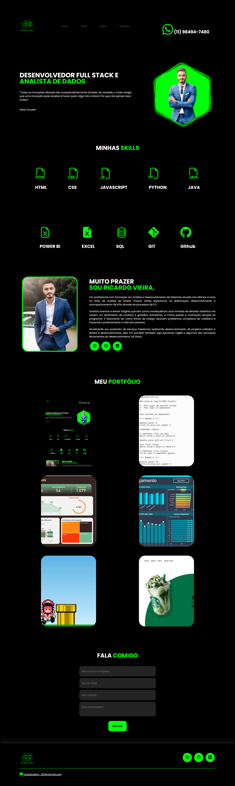

# PAGINA PORTFOLIO

Este é um projeto de uma pagina de portifolio. A pagina conta com apresentação pessoal, descrição de skills, opção de contato e alguns projetos.

## ESTRUTURA E DESENVOLVIMENTO

O site foi construido em html e css puro e possui um design responsivo a desktop e mobile. O principal desafio foi configurar a interface em css para ser responsivel a diferentes tipo de tela.

A pagina foi hospedada no github e está online através do link https://ricarduvieira.github.io/site-portfolio

## TECNOLOGIAS DO PROJETO

- JavaScript

- HTML

- CSS

- Git

- Github

